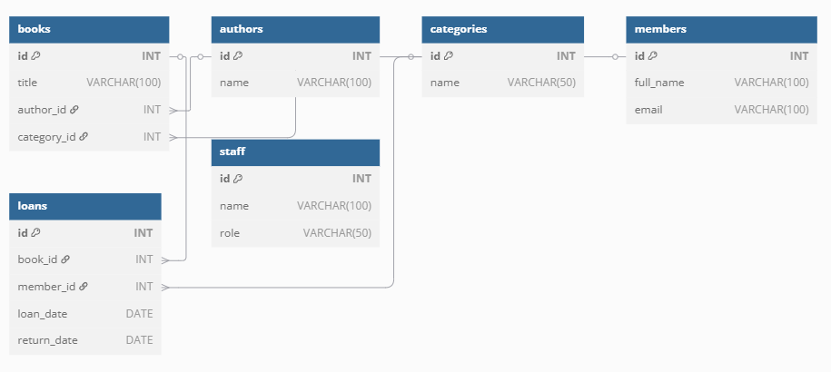

# 📚 Full Database Management System + Contact Book API

## 📘 Question 1: Library Management System – SQL Database Design

A well-structured relational database created using MySQL for managing a Library system. It includes books, authors, members, loans, and staff.

### ✅ Features
- Stores book details and categories
- Tracks loans issued to library members
- Maintains staff and member information
- Supports relationships like one-to-many and many-to-many

### 🗃 Database Schema Overview

**Tables:**
- `books` – Stores book information
- `authors` – Stores author details
- `categories` – Book genres/categories
- `members` – Library members
- `loans` – Tracks which member borrowed which book
- `staff` – Librarians managing the system

### 🛠 Setup Instructions

1. Clone the repo:
   ```bash
   git clone https://github.com/Alois117/Week-8-Assignment.git
   cd Week-8-Assignment
2. Open MySQL and import the SQL file:
mysql -u root -p < library_management.sql
3. Done! Your database is now set up.

🗺 ERD


📒 Question 2: Contact Book API – FastAPI + MySQL
A simple and functional CRUD API for managing contacts and contact groups.

🚀 Features
Add, view, update, and delete contacts

Organize contacts into groups

Built using FastAPI and SQLAlchemy

Connects to a MySQL database

🛠 Setup Instructions
Clone the repo:
git clone https://github.com/Alois117/Week-8-Assignment.git
cd Week-8-Assignment/contact-book-api

Create and activate a virtual environment:
python -m venv venv
source venv/bin/activate  # For Windows: venv\Scripts\activate

Install dependencies:
pip install -r requirements.txt

Import the database:
mysql -u root -p < contact_book.sql

Start the FastAPI server:
uvicorn app.main:app --reload

📂 Project Structure
contact-book-api/
│
├── app/
│   ├── main.py
│   ├── models.py
│   ├── database.py
│   ├── schemas.py
│   └── crud.py
│
├── contact_book.sql
├── requirements.txt
└── README.md

🗺 ERD

