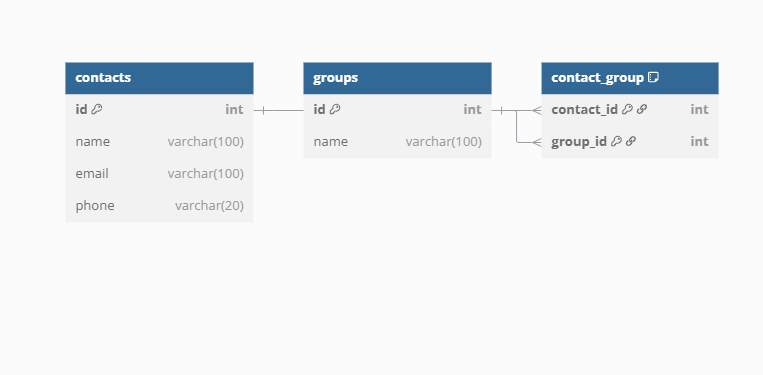

# 📒 Contact Book API

A simple CRUD API for managing contacts and groups using FastAPI + MySQL.

## 🚀 Features

- Add, view, update, and delete contacts
- Organize contacts into groups
- Built using FastAPI and SQLAlchemy

## 🛠 Setup Instructions

1. Clone the repo:
git clone https://github.com/Alois117/Week-8-Assignment.git

2. Create and activate a virtual environment:
python -m venv venv source venv/bin/activate # or venv\Scripts\activate on Windows

3. Install dependencies:
pip install -r requirements.txt

4. Import the database:
- Run the SQL script:
  ```
  mysql -u root -p < contact_book.sql
  ```

5. Start the FastAPI server:
uvicorn app.main:app --reload


## 🗺 ERD



